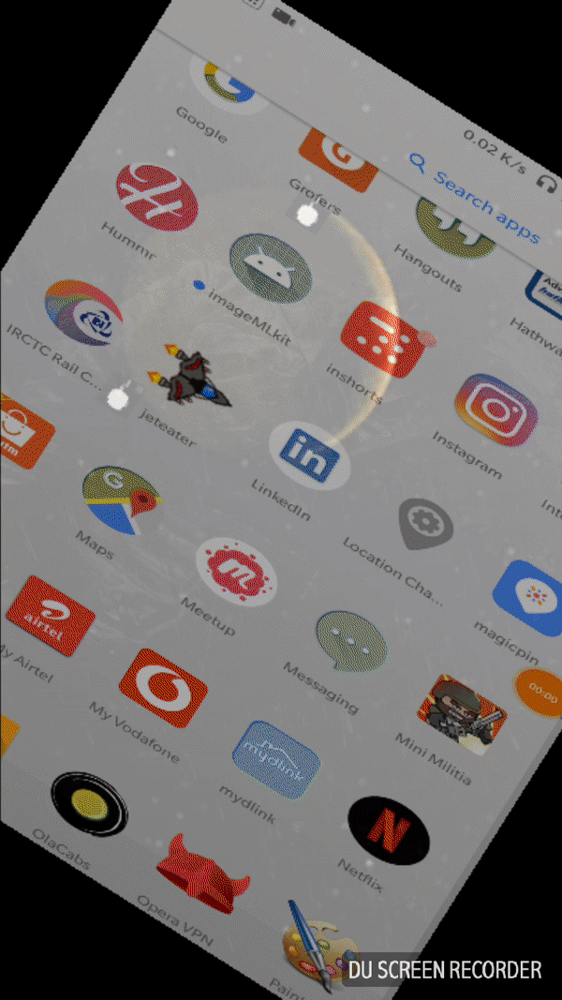

# jeteater
A basic 2D android game using libgdx 
 

## Getting Started

These instructions will get you a copy of the project up and running on your local machine for development and testing purposes. See deployment for notes on how to deploy the project on a live system.

### Prerequisites

Android studio is required to Compile the project.

## Deployment

Just clone the repository and compile it.
press Shift+f10 to execute.
You are done.

## Libraries used
LibGDX is used in this project(https://libgdx.badlogicgames.com/)

## Authors

* **Anand Kumar Rai** - *Initial work* - [Anand Rai](https://github.com/anandkrrai)

## License

GNU General Public License v3.0

